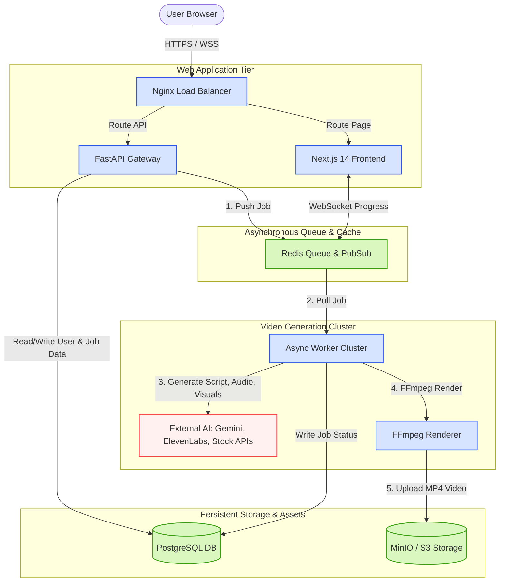
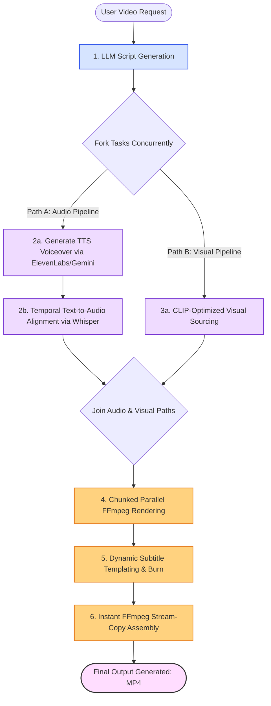
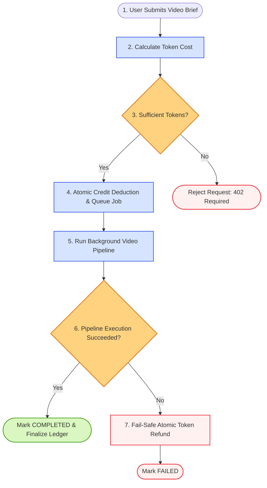
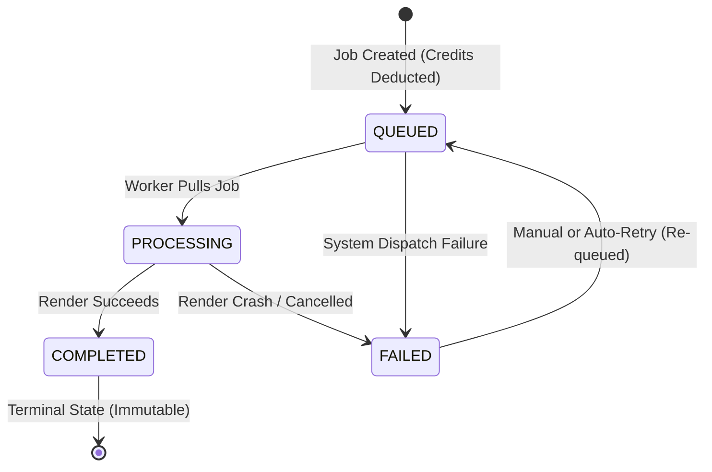

# Cinethra: Enterprise-Grade AI Video Generation Platform

Cinethra is a high-performance, microservices-oriented SaaS platform engineered for high-concurrency AI video production. It transforms complex creative briefs into fully rendered, high-definition videos with dynamic audio, visuals, and stylized subtitles by orchestrating parallel asynchronous workflows.

> **Development Paradigm Note:**  
> This platform was engineered using a modern, AI-augmented development workflow. Leveraging state-of-the-art LLMs for rapid prototyping, parallel unit-test synthesis, and iterative architectural reviews, the codebase achieves high development velocity while strictly adhering to type-safety, clean code architecture, and linting standards.

---

## 🏛️ System Architecture & Design

Cinethra is architected for horizontal scalability, high availability, and loose coupling. The platform separates API management from intensive rendering compute blocks using a task-broker architecture.



### Core Architecture Layers:
1.  **Frontend (`web/`)**: Implemented in **Next.js 14** using App Router and structured via **Feature-Sliced Design (FSD)**. Integrates TanStack Query for state synchronization and WebSockets for real-time video generation feedback.
2.  **API Gateway (`backend/src/api`)**: A **FastAPI** application enforcing authentication (JWT), dynamic rate limiting via Redis, input validation (Pydantic v2), and distributed tracing via transaction correlation IDs (`X-Request-ID`).
3.  **Processing Worker (`backend/src/worker`)**: A collection of stateless background workers that consume job payloads from Redis lists (`video_jobs`). They implement automated retry policies, dead-letter-queues (DLQ), and Sentry integration.

---

## 🎥 The Core Video Generation Pipeline

The computational heart of Cinethra is its **Async Orchestrator** (`backend/src/modules/video/orchestrator_async.py`), which bypasses traditional linear execution bottlenecks to build media parallelly.



### 1. Script Generation & Temporal Alignment
*   **Context-Aware Prompting**: The narrative is generated using LLMs structured around proven retention patterns (Hook, Context, Call-to-Action).
*   **Sub-Second Alignment**: Audio is generated concurrently for each script paragraph (via ElevenLabs or Gemini TTS). To synchronize captions, the audio tracks are analyzed using `whisper-timestamped`. Since audio analysis is CPU-bound, it is offloaded to a background thread pool (`asyncio.to_thread`) to maintain async loop responsiveness.

### 2. Intelligent Visual Selection (The Waterfall Router)
Rather than blindly calling expensive image-generation APIs or taking low-quality stock footage, Cinethra uses a multi-tier **Waterfall Routing Engine** (`backend/src/modules/video/processors/media_router.py`) with semantic ranking:

```mermaid
flowchart TD
    %% Custom Styles
    classDef startStop fill:#fdf,stroke:#333,stroke-width:2px;
    classDef decision fill:#ffd27f,stroke:#e67e22,stroke-width:2px;
    classDef process fill:#d6e4ff,stroke:#2f54eb,stroke-width:1.5px;
    classDef cache fill:#d9f7be,stroke:#389e0d,stroke-width:1.5px;
    classDef parallel fill:#efdbff,stroke:#722ed1,stroke-width:1.5px;
    classDef fallback fill:#fff1f0,stroke:#f5222d,stroke-width:1.5px;

    Start([Start Visual Selection]) --> CheckUpload{Is Source 'upload'?}:::decision
    
    %% Direct Upload Path
    CheckUpload -->|Yes| ResolveUpload[Resolve Upload Reference / URL]:::process
    ResolveUpload --> DownloadUpload[Download / Read Asset Bytes]:::process
    DownloadUpload --> ReturnUpload([Return Uploaded Asset]):::startStop
    
    %% Standard Flow
    CheckUpload -->|No| CacheSearch[Search Stock Cache DB]:::cache
    CacheSearch --> CacheHitCheck{Found Candidates?}:::decision
    
    %% Cache Hit
    CacheHitCheck -->|Yes| ScoreCache[Score Cache Items via CLIP Text-to-Text]:::cache
    ScoreCache --> CacheThresholdCheck{Best Score >= CACHE_HIT_THRESHOLD 0.75?}:::decision
    CacheThresholdCheck -->|Yes| CacheFastPath[FAST PATH: Return Cache Asset URL]:::cache
    CacheFastPath --> TriggerBgRefresh[Spawn Background Thread to Refresh Cache]:::cache
    TriggerBgRefresh --> ReturnCache([Return Cached Video Metadata]):::startStop
    
    %% External API Fallback
    CacheHitCheck -->|No| FetchExternal[Fetch Candidates via Stock APIs Pexels/Pixabay]:::process
    CacheThresholdCheck -->|No| FetchExternal
    
    FetchExternal --> PreFilter{Has Descriptions?}:::decision
    
    %% Text-to-Text CLIP Pre-Filtering
    PreFilter -->|Yes| TextCLIP[Truncate Context to 70 chars & Encode via CLIP Text Encoder]:::process
    TextCLIP --> CosSimText[Calculate Cosine Similarity with Descriptions]:::process
    CosSimText --> SortTop5[Sort & Keep Top 5 Candidates]:::process
    CosSimText -.->|Save to DB| SaveCacheBg[Background Cache Save]:::cache
    
    PreFilter -->|No| DownloadThumbs
    SortTop5 --> DownloadThumbs[Download Previews in Parallel via ThreadPoolExecutor]:::parallel
    
    %% Visual CLIP Verification
    DownloadThumbs --> EncodeImages[Encode Thumbnails via CLIP Image Encoder]:::process
    EncodeImages --> CosSimImage[Calculate Image-to-Text Cosine Similarity]:::process
    CosSimImage --> GetBestCandidate[Select Highest-Scoring Candidate]:::process
    
    %% Thresholding & Duplication Check
    GetBestCandidate --> CheckThreshold{Score >= Provider Threshold?}:::decision
    
    CheckThreshold -->|Yes| CheckUsed{Is Candidate ID in used_media_ids?}:::decision
    CheckThreshold -->|No| AIFallback
    
    %% Smart Reuse Logic
    CheckUsed -->|No| UseFresh[Use Asset at offset 0.0]:::process
    UseFresh --> MarkUsed[Mark ID as Used]:::process
    MarkUsed --> DownloadFull[Download Full Asset Video/Image Bytes]:::process
    
    CheckUsed -->|Yes| CalcOffset[Calculate start_offset = previous_offset + duration_needed]:::process
    CalcOffset --> DownloadFull
    
    DownloadFull --> ReturnAsset([Return Asset Bytes with Offset]):::startStop
    
    %% AI Fallback System
    AIFallback{AI Fallback Enabled?}:::decision
    AIFallback -->|No| ReturnNone([Return None]):::startStop
    AIFallback -->|Yes| PollinationsAttempt[Pollinations AI Generation Attempt 1-3]:::fallback
    PollinationsAttempt --> CheckImageValid{Valid & Non-Black Image?}:::decision
    CheckImageValid -->|Yes| ReturnAI([Return GenAI Image Bytes]):::startStop
    CheckImageValid -->|No| GeminiFallback[Gemini Image Generator Fallback]:::fallback
    GeminiFallback --> ReturnAI
```



*   **Fast-Path Database Cache**: The router first checks the local PG cache for previous queries. If a candidate exceeds the `CACHE_HIT_THRESHOLD` (0.75 similarity), it returns immediately and fires a background thread to refresh the cache.
*   **Waterfall Fallback**: If the cache misses, the engine attempts to fetch from the **Primary Stock API** (Pexels or Pixabay). If similarity scores are low, it falls back to the **Secondary Stock API**. If stock search fails, it falls back to generative AI (**Pollinations API** with 3 retries and automatic black/corrupted image filtering, or **Gemini Image Generator**).
*   **Semantic Scoring via CLIP** (`backend/src/modules/video/processors/media_base.py`):
    1.  **Text Pre-filtering**: The script segment is truncated to 70 characters (staying within the strict 77-token CLIP limit) and compared against candidate video/image descriptions using the CLIP text encoder (`ViT-B-32`). Only the top 5 candidates are retained.
    2.  **Visual Verification**: The engine downloads the thumbnails of these top 5 candidates in parallel using a `ThreadPoolExecutor` (5 workers). It generates image embeddings and runs cosine similarity (`util.cos_sim`) against the text context. The candidate with the highest score above the threshold wins.
*   **Visual Monotony & Reuse Mitigation**: If a video asset is reused within the same pipeline, the router calculates a rolling play-head offset to ensure that instead of showing the identical starting frames (monotony), it takes a fresh cut of the same footage:
    `start_offset = previous_offset + duration_needed`
    This provides zero-API-latency visual variation:

    ```mermaid
    graph TD
        subgraph Scene_Rendering_Sequence [Scene Slicing & Offset Engine]
            direction TB
            
            %% Scene 1
            S1[Scene 1: Needs 5s] -->|First Use of Clip A| Cut1[Slice 0s - 5s of Clip A]:::action
            Cut1 -->|Store Offset| Mem[Memory Cache: Clip A Offset = 5s]:::db
            
            %% Scene 2
            S2[Scene 2: Needs 7s] -->|Uses Clip B| Cut2[Slice 0s - 7s of Clip B]:::action
            
            %% Scene 3
            S3[Scene 3: Needs 5s] -->|Reuses Clip A| Read[Read Current Offset: 5s]:::action
            Mem -.->|Zero API Latency Query| Read
            Read --> Cut3[Slice 5s - 10s of Clip A]:::action
            Cut3 -->|Update Offset| MemUpdate[Memory Cache: Clip A Offset = 10s]:::db
        end

        classDef action fill:#d6e4ff,stroke:#2f54eb,stroke-width:1.5px;
        classDef db fill:#d9f7be,stroke:#389e0d,stroke-width:1.5px;
    ```

### 3. Chunked Rendering & Stream Copy
*   To bypass FFmpeg's sequential rendering limits, the composition is split into discrete time-chunks.
*   Chunks are rendered concurrently. The final assembly utilizes FFmpeg's low-overhead **Stream-Copy** feature (`ffmpeg -c copy`), joining the finished chunks instantly without unnecessary re-encoding cycles.

---

## 💰 Ledger System & Token Economy

Cinethra features a transactional **Token-based Pricing System** designed for enterprise billing fairness:



*   **Granular Billing Calculator**:
    ```python
    def calculate_cost(self, duration_minutes: float, pipeline_controls: dict, resolution: str) -> int:
        base_cost = self.config["base_cost_per_minute"] * duration_minutes
        # Scaled pricing based on premium features toggled by the user
        ...
        return max(10, int(base_cost))
    ```
*   **Atomic Credit Check**: Before a background worker receives the job, the API checks the database for balance sufficiency (`user.tokens_balance >= cost`).
*   **Idempotency & Safety**: Credit reservations and refunds (in case of pipeline failures) are wrapped in atomic database sessions to prevent double-spending or credit leaks.

---

## 🔄 Reliability & Job State Machine

To guarantee transactional consistency and fault tolerance during long-running async renders, job states are strictly managed via a deterministic state machine:



*   **Legal State Transitions**: Enforces boundary rules preventing illegal state progression (e.g. an active job cannot bypass `PROCESSING` to jump straight to `COMPLETED`).
*   **Terminal Immutability**: Once a job is marked `COMPLETED`, it enters a terminal, immutable state. This protects finalized output assets and financial records from state corruption.
*   **Controlled Retry Paths**: If a job fails, the engine allows controlled transitions back to `QUEUED` to re-trigger execution while preserving the original session logging history.

---

## 🛠️ Technology Stack

| Layer | Technologies | Role / Feature |
|---|---|---|
| **Frontend** | Next.js 14, TypeScript, Tailwind CSS, Framer Motion, TanStack Query | App Router, FSD Architecture, WebSocket Client |
| **Backend** | Python 3.12, FastAPI, SQLAlchemy (Async), Alembic | Ingress routing, Pydantic v2 schemas, DB migrations |
| **Broker / Cache** | Redis | Job queue, real-time WebSocket pub-sub, rate-limiting |
| **Database** | PostgreSQL | Persistent users, balance ledger, jobs, and cached stock data |
| **AI Models** | sentence-transformers (CLIP ViT-B-32), OpenAI/Gemini, Whisper | Semantic matching, script/voice/image generation, transcription |
| **Media Processing** | FFmpeg, PIL, OpenCV | Video composition, subtitle burning, stream copy |
| **Infrastructure** | Docker Compose, Nginx, Sentry, MinIO | Local orchestration, reverse proxying, tracing, S3 storage |

---

## 🚀 Running Locally

The entire system (including database, cache, mock storage, and frontend proxy) is fully containerized.

1.  **Clone and Configure**:
    ```bash
    cp .env.example .env
    ```
2.  **Spin Up Environment**:
    ```bash
    docker compose -f docker-compose.dev.yml up --build
    ```
3.  **Run Verification & Tests**:
    *   **Backend Lint**: `docker compose -f docker-compose.dev.yml run --rm api ruff check .`
    *   **Backend Tests**: `docker compose -f docker-compose.dev.yml run --rm api pytest`
    *   **Frontend Lint**: `docker compose -f docker-compose.dev.yml run --rm web npm run lint`

---

## 📄 Licensing & IP Protection

This project is source-available and released under the **GNU Affero General Public License v3 (AGPL-3.0)**. 

*   **Commercial Use Restriction**: Any commercial usage, closed-source derivative work, or deployment of this platform as a service (SaaS) without explicit authorization from the author is strictly prohibited.
*   **Academic & Review Use**: You are free to view, audit, run locally, and review the codebase for hiring, screening, or educational evaluation purposes.


---

